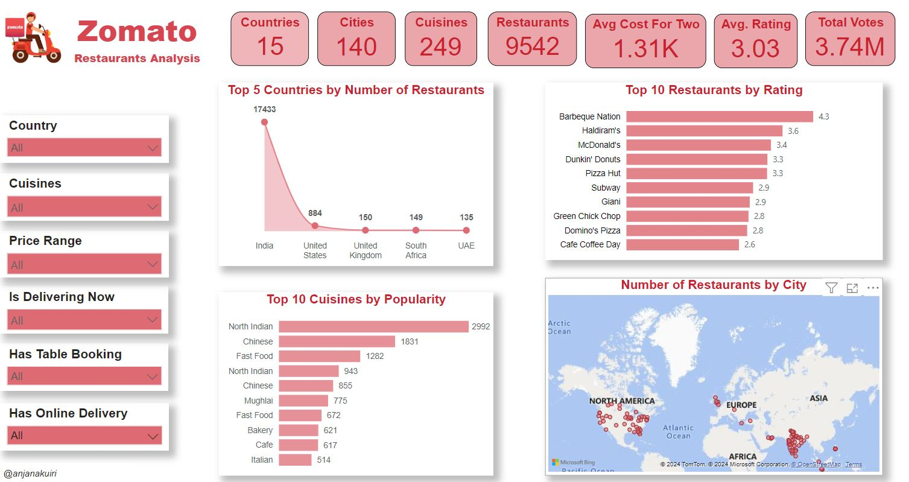

# Zomato Restaurants Analysis Power BI Dashboard

## Overview

This Power BI dashboard presents a comprehensive analysis of Zomato Restaurant Data, showcasing key insights into restaurant operations, customer preferences and regional trends. This README provides users with guidance on navigating the report, understanding the data model and utilizing the various visualizations for detailed insights.

## Contents

- [Data Sources](#data-sources)
- [Data Model](#data-model)
- [Report Pages & Visuals](#report-pages--visuals)
- [Core Metrics & Calculations](#core-metrics--calculations)
- [Filters and Slicers](#filters-and-slicers)
- [User Guide](#user-guide)
- [Assumptions & Limitations](#assumptions--limitations)
- [Additional Information](#additional-information)

---

### Data Sources

- **Primary Data Source**: Zomato's restaurant dataset, potentially including details like restaurant names, locations, types of cuisine, ratings, price categories, and customer reviews.
- **File Name**: Zomato-Restaurants-Analysis.pbix

### Data Model

This dashboard's data model organizes tables and relationships critical for analyzing various elements of restaurant performance. Key tables include:

- **Restaurant**: Contains attributes for each restaurant, such as name, cuisine, and location.
- **Location**: Stores geographic data for city, area, and other location-specific information.
- **Ratings**: Aggregates customer ratings and reviews.
- **Orders**: Includes data on customer orders, pricing, and preferences.

### Report Pages & Visuals

The dashboard is divided into several pages, each focusing on a unique aspect of restaurant analysis. Example pages are:

1. **Overview**: High-level metrics, such as the total number of restaurants, average customer ratings, and popular cuisines.
2. **Location Insights**: Map view showing restaurant distribution across cities or regions.
3. **Cuisine Trends**: Analysis of cuisine offerings and popularity based on customer ratings or orders.
4. **Pricing Overview**: Pricing data insights, comparing cost levels across various locations or cuisine types.
5. **Customer Feedback**: Visuals such as word clouds or tables to show prominent feedback keywords and overall sentiment.

### Core Metrics & Calculations

Key performance metrics provide valuable insights into restaurant performance:

- **Average Rating**: Calculated as the mean rating across customer reviews.
- **Total Restaurants**: A unique count of restaurant entries.
- **Cuisine Popularity Score**: A ranking metric based on the frequency of each cuisine in orders or reviews.
- **Price Category Analysis**: Analysis of restaurants by price levels (e.g., budget, mid-range, upscale).
- **Sentiment Analysis**: An index or score derived from customer feedback sentiment.

### Filters and Slicers

To allow for dynamic data exploration, this dashboard includes several interactive filters:

- **Location**: Filter data based on specific cities or areas.
- **Cuisine Type**: Filter by the type of cuisine.
- **Price Level**: Select various price categories.
- **Ratings Range**: Adjust the range for restaurant ratings to explore different quality levels.

These slicers enable users to customize their view and focus on specific data segments.

### User Guide

1. **Navigating Pages**: Move between different pages to explore various facets of restaurant data.
2. **Using Filters**: Apply slicers on each page to refine the data by attributes like location or cuisine type.
3. **Reading Visuals**: Hover over charts for tooltips that show specific data points and metrics.
4. **Exporting Data**: Export visual data if further analysis is needed.

### Assumptions & Limitations

- **Data Completeness**: The analysis is dependent on the accuracy and completeness of Zomato's data.
- **Geographic Relevance**: Some insights may be region-specific.
- **Temporal Data Coverage**: Trends may vary based on the time period of data included in the report.

### Additional Information

- **Data Refresh**: For live data, ensure the report is refreshed regularly to maintain accuracy.
- **Feedback**: For any suggestions or feedback on improving this report, please contact the report author.

